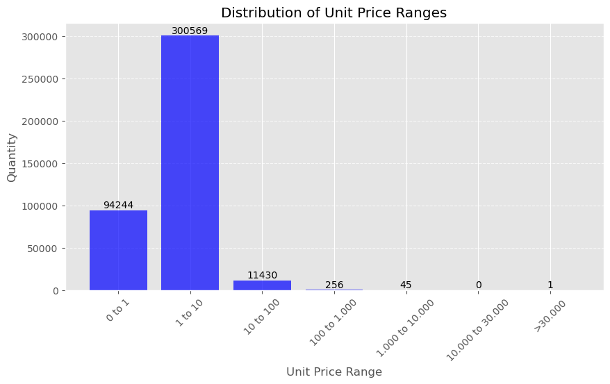
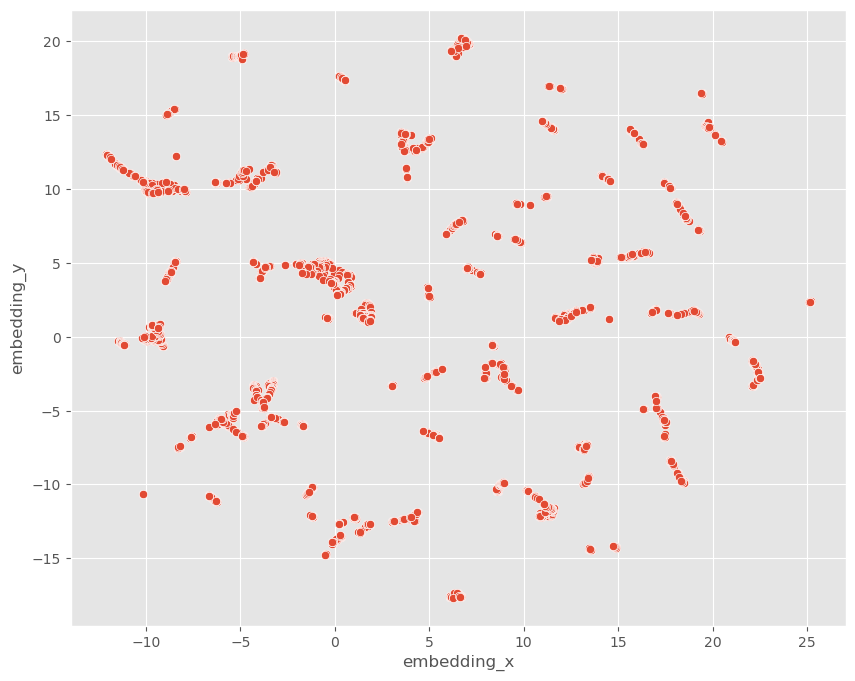
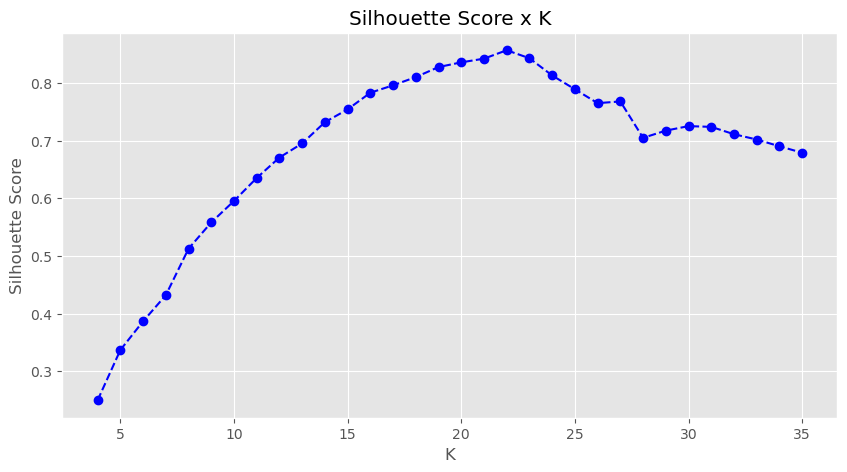
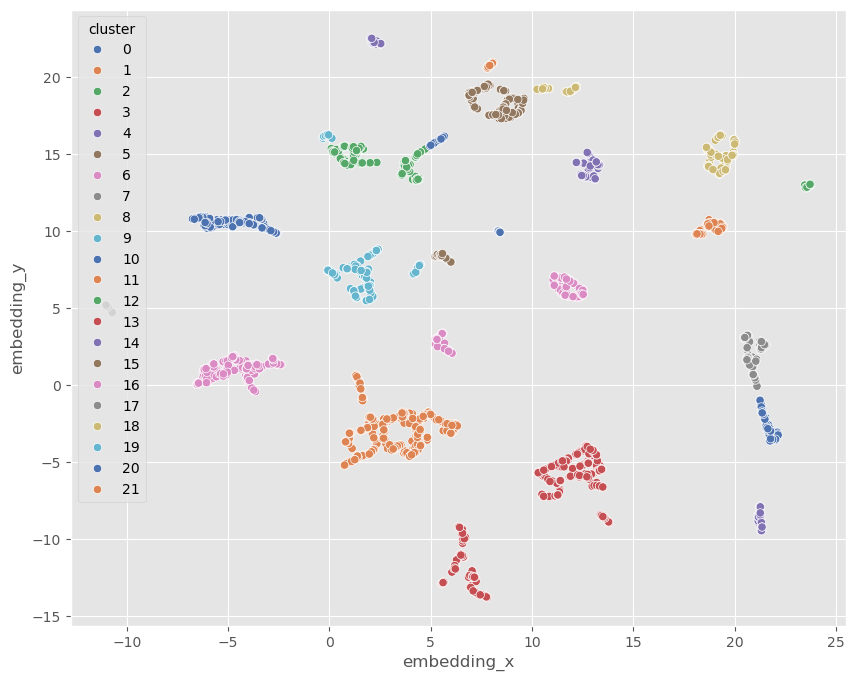
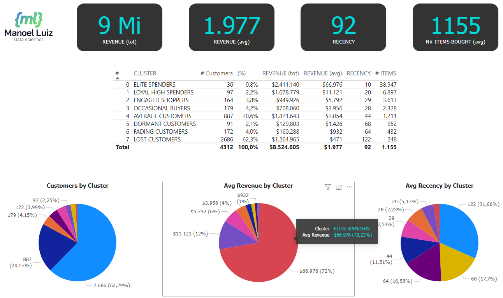
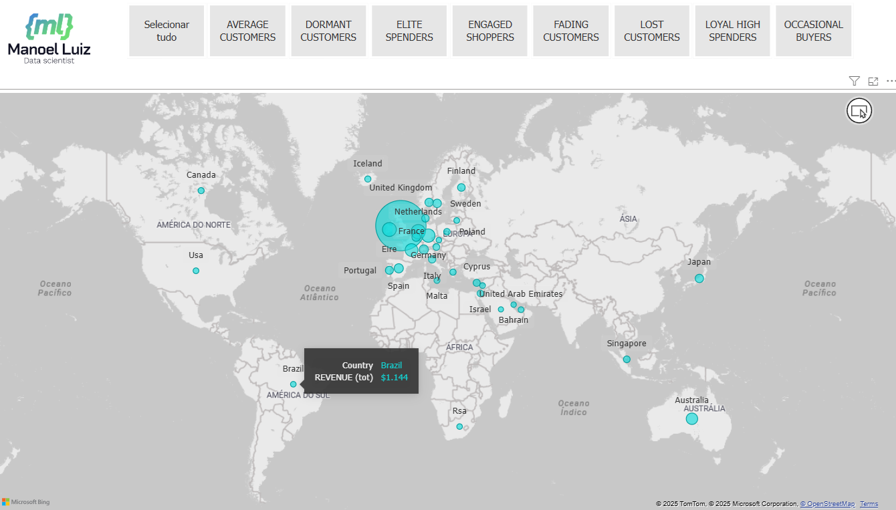

<h1 align="center">
MACHINE LEARNING PROJECT HIGH VALUE CUSTOMERS IDENTIFICATION 
</h1>

<h6>- <a href="README.md">VERSÃO EM PORTUGUÊS</a></h6>

# 1. INTRODUCTION

This report describes a Data Science project that involves the creation of a **clustering algorithm** using machine learning to analyze customers' behavior in an e-commerce company and segment them into groups with similar characteristics. The goal is to support the development of a targeted marketing strategy.

In this project, we utilized the following tools and techniques:

- **Tools**: VS-Code, Jupyter Notebook, Mini Conda, GitHub, GPT-4  
- **Programming & Libraries**: Python, Pandas, Numpy, Scikit-Learn, Matplotlib, Seaborn  
- **Machine Learning Models**: RandomForest, ExtraTrees, LightGBM, CatBoost, XGBoost  
- **Dimensionality Reduction**: UMAP, t-SNE, PCA  
- **Clustering Algorithms**: Gaussian Mixture Model, K-Means  
- **Tree-based Embedding**: Using RandomForest & UMAP  

As will be presented, using this project, it was possible to build a system capable of performing customer clustering, along with a front-end interface that allows business managers and marketing team to utilize it.

This project is based on a fictional case and utilizes a dataset from [Kaggle](https://www.kaggle.com/vik2012kvs/high-value-customers-identification).

However, it should be emphasized that the MAIN FOCUS is not just the creation of a machine learning solution for a data science competition, but rather the analysis of the business as a whole, aiming to understand the aspects that impact performance, with a view to improving the company's performance.

# 2. THE CONTEXT AND BUSINESS PROBLEM

In the fictional context of this project, there is a Multi-Brand Outlet company, which is a company that sells second-line products from various brands at a lower price through an e-commerce site.

In this company, the marketing team recently observed that some customers in their database frequently purchase more expensive products, contributing significantly to the company's revenue. Therefore, it was decided to launch a marketing campaign - the INSIDERS LOYALTY PROGRAM - aimed at the best customers in the database.

However, it would not be trivial for the marketing team to identify and select the customers eligible to participate in the program, given the high number of customers and the plan to perform periodic reviews of the participant lists. Because of this, the data science team was asked to conduct a study to select customers eligible for the program.

The task of the data science team consists of determining the customers eligible to participate in the INSIDERS LOYALTY PROGRAM marketing campaign. This involves segmenting the customers based on their purchases, to facilitate the execution of the envisioned marketing strategy.

# 3. SOLUTION PLANNING

The solution to the described business problem lies in the use of clustering algorithms, which allow identifying groups of similar people in a population and then allocating them to respective groups, or clusters.

## 3.1. Final Product

As outlined above, the goal is to train clustering algorithms to identify customers eligible to participate in the INSIDERS LOYALTY PROGRAM marketing campaign. Therefore, the delivered solution includes the following results:

- [Result No. 1](#11-result-i-main-business-insights) - Insights related to the customer base, especially regarding the customers most suitable for participation in the INSIDERS PROGRAM.

- [Result No. 2](#12-result-ii-machine-learning-system-for-customer-segmentation) - Python-based machine learning system for customer segmentation.

- [Result No. 3](#13-results-iii-power-bi-dashboard) - Power BI dashboard for use by the marketing team, allowing for dynamic visualization of the clusters, their key performance indicators (KPIs), and the list of customers in each cluster.

## 3.2. Solution Strategy

The work was conducted following the CRISP-DM method (or "Cross Industry Standard Process for Data Mining"), a cyclical approach that enhances the quality and speeds up the delivery of results in Data Science projects. The method can be summarized in the following set of steps:

1. Business Understanding
2. Data Collection, Processing, and Modeling
3. Machine Learning Algorithms
4. Results Evaluation
5. Deployment.

# 4. AVAILABLE DATA

The data is available in the ECOMMERCE.CSV file, comprising 541,909 purchase records, containing the following eight columns:

<table align="center">
  <tr>
    <th align="center">ATTRIBUTE</th>
    <th>DESCRIPTION AND OBSERVATIONS</th>
  </tr>
  <tr>
    <td align="center">InvoiceNo</td>
    <td>Unique identifier of the consumer sales invoice.</td>
  </tr>
  <tr>
    <td align="center">InvoiceDate</td>
    <td>Date of invoice issuance, or date of the sale of the merchandise.</td>
  </tr>
  <tr>
    <td align="center">CustomerID</td>
    <td>Unique identifier of the customer.</td>
  </tr>
  <tr>
    <td align="center">Country</td>
    <td>Country of purchase origin.</td>
  </tr>
  <tr>
    <td align="center">StockCode</td>
    <td>Unique identifier of the merchandise sold.</td>
  </tr>
  <tr>
    <td align="center">Description</td>
    <td>Free text description of the merchandise sold.</td>
  </tr>
  <tr>
    <td align="center">Quantity</td>
    <td>Number of units sold of the product.</td>
  </tr>
  <tr>
    <td align="center">UnitPrice</td>
    <td>Unit price of the product sold.</td>
  </tr>
</table>

The data presents a typical **INVOICE** structure, with information related to the following elements:

1. **SELLER** of goods or services, along with its registration details, such as name, address, and registration number with official bodies. In our practical case, as it concerns a single company, this information is not included in the CSV database.

2. **CUSTOMER** who purchases the goods or services, along with their registration details, such as name, identification number, and delivery address of the products. In our case, only the identification code (customer_id) and the country related to the invoice are included.

3. **DESCRIPTION OF THE GOODS** being negotiated. In our database, the code and description of each merchandise are listed.

4. **PURCHASES** included in the invoice, as a single invoice can involve the sale-purchase of various goods. Our database includes information about the goods being negotiated, the sale prices, the quantities sold, and the date of the transaction.

From this information, we can visualize the ECOMMERCE.CSV database according to the following simplified model:

<table align="center">
<tr><td>

</td></tr>
</table>

# 5. DATA PREPARATION

A detailed examination of the data required: loading the data file, content verification, handling of missing data - NaNs, descriptive statistics, close observation of the data, deletion of rows and columns, and feature engineering.

The code can be consulted in sections 0 to 3 of the [Jupyter Notebook](https://github.com/manoelmendonca/customers_clustering/blob/main/notebooks/insider_customers.ipynb). Some of the more important aspects are discussed below.

## 5.1. Handling Missing Data (NaN)

Data inspection (section 1.1 of the code) revealed the existence of 135,080 records where **customer_id** = NaN. This is a high percentage, corresponding to 24.9% of the database. Two approaches were used to handle this for clustering purposes.

- In the first CRISP-DM round, there was an attempt to utilize these data by synthesizing fictitious values for the missing data. As a result, the optimal clustering occurred with approximately 32 clusters. Ultimately, we considered the result inappropriate, as the fictitious customers would act as noise, complicating the clustering of real customers.

- In the second approach, the 135,080 records were discarded, which resulted in more assertive clustering with 22 clusters. This was the final solution adopted for this project.

As a final note, if these 135,080 records are important for use in future machine learning algorithms, they can be utilized through an intelligent procedure of measuring similarity between purchases with unknown IDs (NaN) and purchases from known customers. This approach is beyond the scope of the current work.

## 5.2. Descriptive Statistics

Section 1.5 of the code provides detailed notes describing the peculiarities of the database, as well as conclusions regarding the maintenance or deletion of data in each case. The purpose of these notes was to ensure the highest quality of data presented to the machine learning algorithms. For those interested, we suggest reading section 1.5 in the [notebook](https://github.com/manoelmendonca/customers_clustering/blob/main/notebooks/insider_customers.ipynb).

The numerical variables have the characteristics presented in the table below (section 1.5.1 of the code).

<table align="center">
    <tr align="right;">
      <th align="center">attributes</th>
      <th align="center">min</th>
      <th align="center">max</th>
      <th align="center">range</th>
      <th align="center">mean</th>
      <th align="center">median</th>
      <th align="center">std</th>
    </tr>
    <tr>
      <td align="center">quantity</td>
      <td align="right">-80,995.00</td>
      <td align="right">80,995.00</td>
      <td align="right">161,990.00</td>
      <td align="right">12.06</td>
      <td align="right">5.00</td>
      <td align="right">248.77</td>
    </tr>
    <tr>
      <td align="center">unit_price</td>
      <td align="right">0.00</td>
      <td align="right">38,970.00</td>
      <td align="right">38,970.00</td>
      <td align="right">3.46</td>
      <td align="right">1.95</td>
      <td align="right">69.34</td>
    </tr>
    <tr>
      <td align="center">customer_id</td>
      <td align="right">12,346.00</td>
      <td align="right">18,287.00</td>
      <td align="right">5,941.00</td>
      <td align="right">15,288.63</td>
      <td align="right">15,152.00</td>
      <td align="right">1,713.28</td>
    </tr>
    <tr>
      <td align="center">latitude</td>
      <td align="right">-30.56</td>
      <td align="right">64.96</td>
      <td align="right">95.52</td>
      <td align="right">54.40</td>
      <td align="right">55.38</td>
      <td align="right">5.54</td>
    </tr>
    <tr>
      <td align="center">longitude</td>
      <td align="right">-106.35</td>
      <td align="right">138.25</td>
      <td align="right">244.60</td>
      <td align="right">-2.14</td>
      <td align="right">-3.44</td>
      <td align="right">10.40</td>
    </tr>
</table>

The table indicates there are records with negative values for the **quantity** of products sold. It is inferred that these are returned products. To address this characteristic, the records were split into two tables: a table for purchased products, **df2_purchase**, and for returned products, **df2_returns** (section 2.4 of the code).

Regarding the **unit_price** column, the table shows a very marked difference between the maximum value of $38,970 and the median of just $1.95. Indeed, the bar chart shows that 97% of the records contain values below $10, with only one value above $30,000.

<table align="center">
<tr><td>

</td></tr>
</table>

## 5.3. Data Filtering

Data filtering is covered in section 2 of the code and was based on the detailed notes from section 1.5. The following procedures were carried out:

- Forced uppercase for the columns **invoice_no** and **stock_code**, as it was noticed that **stock_code** = '82001S' and **stock_code** = '82001s' referred to the same merchandise.
- Forced the **country** column to contain names starting with an uppercase letter, with all subsequent characters in lowercase.
- Deleted rows where **unit_price** <= 0
- Deleted rows where **country** = 'Unspecified'
- Deleted rows where **stock_code** = 'AMAZONFEE', 'B', 'BANK CHARGES', 'M', 'S'
- Forced negative values of **quantity** to positive (using abs function) when **stock_code**='CRUK', as a donation to Cancer Research UK should be treated accountably like a purchase of merchandise.
- Deleted rows relating to **customer_id** = 12346, 16446, 15098, 15749, due to having more products returned than purchased.
- Deleted rows relating to **customer_id** who have returned more than 90% of all purchased merchandise.
- Deleted rows for which **customer_id** = NaN.

In the end, out of the original 541,909 records, 405,522 remained (25.14% deleted), including:
- 24.9% (135,080 records) deleted, related to **customer_id** = NaN and
- 0.24% (1,307 records) deleted, related to other rules.

The **description** (of merchandise) column was removed from the database (section 2.3 of the code). Some tests were conducted using this information, but no benefits for the purpose of customer clustering were obtained. Therefore, for the sake of objectivity, the final decision was to discard this information.

## 5.4. Feature Engineering: Recency, Frequency, and Monetary Value

In section 3 of the code - Feature Engineering - the construction of a consumer database (**df_ref**) began, meaning there is a record for each **customer_id** value. In this database, performance indicators per consumer were constructed (section 3.1 of the code) to highlight:

- Recency: the number of days since the customer's last visit.
- Frequency: how often the customer has purchased throughout their history.
- Monetary Value: how much the customer typically spends.

The constructed indicators were as follows:

<table align="center">
  <tr>
    <th align="center">Indicator</th>
    <th>Description</th>
  </tr>
  <tr>
    <td align="center">Gross Revenue</td>
    <td>= sum (unit_price * quantity)</td>
  </tr>
  <tr>
    <td align="center">Recency</td>
    <td>Number of days since each customer's last purchase</td>
  </tr>
  <tr>
    <td align="center">N# Invoices</td>
    <td>Number of invoices per customer</td>
  </tr>
  <tr>
    <td align="center">N# Items</td>
    <td>Number of items purchased by each customer</td>
  </tr>
  <tr>
    <td align="center">N# Unique Items</td>
    <td>Number of different types of products purchased by each customer</td>
  </tr>
  <tr>
    <td align="center">Average Ticket</td>
    <td>Average value of items purchased per customer</td>
  </tr>
  <tr>
    <td align="center">Average Recency Between Purchases</td>
    <td>Average number of days between two purchases</td>
  </tr>
  <tr>
    <td align="center">N# of Returns</td>
    <td>Number of products returned by each customer</td>
  </tr>
  <tr>
    <td align="center">Basket Size</td>
    <td>Average number of products in an invoice, per customer</td>
  </tr>
  <tr>
    <td align="center">Unique Products Basket Size</td>
    <td>Average number of unique products in an invoice, per customer</td>
  </tr>
  <tr>
    <td align="center">Return Rate</td>
    <td>(number of returns) divided by (number of items purchased)</td>
  </tr>
</table>

## 5.5. Feature Engineering: the Countries

From the information on the customers' countries, an attempt was made to create indicators using one-hot encoding. However, this procedure did not result in an improvement in the clustering outcomes, so its use in the project was discarded.

## 5.6. Feature Engineering: revenue by day of the week and month

Idea: Is there any similarity among customers who always buy on Mondays, or on Saturdays? Similarly, are there similarities among customers who always make purchases on the 10th of each month?

To capture this type of behavior, the gross revenue of each customer was distributed among the seven days of the week, according to their respective purchase dates. Similarly, the gross revenue was distributed among the 31 days of the month. The distributed values were then converted into percentages, creating seven features for revenue by day of the week and 31 features by day of the month.

The processing begins in section 3.1.1 and is completed in section 3.3 of the code.

These features brought improvements to the procedure, increasing the silhouette score measurement of the clustering.

## 5.7. Feature Engineering: fictional names

The synthesis of fictional names for the customer base (section 3.4 of the code) was not aimed at improving clustering. The initial intent was to humanize the front-end screens of the project.

However, the procedure brought an UNEXPECTED BENEFIT regarding records lacking **customer_id**. In the first round of the project, we attempted to utilize the 24.9% of records without a known customer. However, for these, we did not assign names but simply labeled them as "UNKNOWN". As a result, in the final dashboard, it was evident that there were "UNKNOWN" customers in all clusters. This was considered an unacceptable characteristic for the project. Ultimately, it was the creation of fictional names and the use of the dashboard that highlighted the need to redo the procedures with the exclusion of records lacking **customer_id**.

In the algorithm for generating fictional names, two lists were compiled:

- a list of names from international cinema & TV characters, and
- a list of typical, unique and even invented Brazilian last names.

The final assembly of the names was done by randomly combining a first name with two last names. For example, some of the results obtained include:

- Forrest Gump Virgulino Denteleite
- Black Panther do Monte Avelino
- Bruce Banner Terceiro Pinto
- Captain America Terto da Silva

# 6. EXPLORATORY DATA ANALYSIS - EDA

In section 4 of the code, a univariate analysis of the data from the database was conducted to verify, for each feature:

- whether the mean and median are close, the range of value distribution, and whether the information seems natural or if there are potential outliers,
- if the coefficient of variation (CV) is compatible with the mean,
- if extreme values are acceptable or would be considered outliers,
- then, removal of improper or incorrect values (=trash).

To perform these analyses, the ydata_profiling library and its ProfileReport function were used. The results enabled the creation of a series of very detailed observation notes, contained in sections 4.1.13 and 1.5 of the code.

# 7. CLUSTERING WITH DECISION TREE-BASED EMBEDDING

In this project, the clustering of individuals is performed through a three-step procedure, namely:
- (i) classification of individuals using decision trees, or random forest;
- (ii) dimensionality reduction of the classified individuals' database, using algorithms such as UMAP, PCA, or t-SNE; and
- (iii) clustering of the resulting database, using K-Means or GMM.

The algorithm is constructed in sections 5.3.0 and 6.2 of the code.

The embedding method consists of "a dense representation of some higher-dimensional data, such as a category, or a word in a vocabulary" (Géron1, pg. 466). As an example, the figure below (section 5.2.2 of the code) shows the reduction of the project's database to two dimensions using the UMAP algorithm:

<table align="center">
<tr><td>

</td></tr>
</table>

The next figure presents the project's database subjected to the classification procedure by Random Forest, followed by dimensionality reduction using UMAP. It is observed that, unlike the previous figure, in this case, it was possible to generate a large number of well-separated groups, which will undoubtedly reflect in greater efficiency of the clustering algorithm.

<table align="center">
<tr><td>

</td></tr>
</table>

Among the advantages of this strategy in the present project is the achievement of high-quality groupings, as evidenced by the high levels obtained for the silhouette score indicator, exceeding 80% in this project.

On the other hand, the downside is the impossibility of interpreting the results, i.e., there is no clear explanation of the reasons that led certain individuals to be placed in the same cluster.

# 8. FEATURE SELECTION

After the feature engineering step resulted in the creation of 50 columns in the database, it became necessary to determine which of these features would truly be capable of improving the model's performance.

In this project, we started with the model incorporating all 50 features and applied the technique of Recursive Feature Elimination (RFE). This is referred to as a "brute force" procedure, as it requires substantial processing resources.

The method (section 5.3 of the code) was constructed with the following steps:

1. Run the model with all 50 possible features to establish a baseline performance;
2. Begin the Recursive Feature Elimination (RFE) process in two loops:
3. OUTER-LOOP: controls the reduction, one by one, of the number of features in the test set
4. INNER-LOOP: given the set of N test features (defined in the OUTER-LOOP), run the model N times, excluding one of the features each time
5. Calculate the silhouette score and check for performance improvement without that feature. If positive, identify a "champion" feature, candidate for exclusion.
6. End of the INNER-LOOP
7. Save the champion feature and update the list of test features by excluding the "champion"
8. End of the OUTER-LOOP: when there are no more champions, or if a minimum number of features is reached

Using this procedure, and after almost 20 hours of processing, we arrived at an optimal set of 16 features.

# 9. OPTIMIZATION OF MACHINE LEARNING MODELS

As described above ([section 7](#7-clustering-with-decision-tree-based-embedding)), clustering is carried out in three stages. But what are the most efficient algorithms at each stage? And what are the best values for their hyperparameters?

To answer these questions, we ran the following sequence of optimization steps (section 6 of the code):

1. Test the type of tree algorithm: RandomForest, ExtraTrees, LightGbm, CatBoost, XGBoost.
2. Variation of the n_estimators hyperparameter (number of estimators) for the tree selected in the previous step.
3. Test the type of dimensionality reduction function: UMAP, TSNE, PCA.
4. Test the hyperparameter for dimension of the selected dimensionality reduction function in the previous step.
5. Test different clustering algorithms, in this case: K-Means or GMM.

The tests indicated the following set of algorithms and hyperparameters as the best selection:
- Random Forest with n_estimators = 300,
- UMAP with dimension 43,
- clustering with GMM - Gaussian Mixture Model, and
- number of clusters = 22.

Note that sometimes UMAP is set to 2 dimensions when the goal is to visualize a multidimensional database in 2D. On the other hand, for optimization purposes, the dimension will be chosen by the optimization algorithm, as described in this section.

Below is the graph of the silhouette score as a function of the number K of clusters, indicating a maximum silhouette of 85.65% for K = 22.

<table align="center">
<tr><td>

</td></tr>
</table>

The model with 22 clusters can be visualized in two dimensions as shown in the following image (section 6.3.3 of the code):

<table align="center">
<tr><td>

</td></tr>
</table>

# 10. ANALYSIS OF CLUSTERS ACCORDING TO BUSINESS CRITERIA

Once the optimal cluster division was obtained under machine learning criteria, we proceeded to the evaluation in terms of meeting business requirements with a view to the implementation of marketing strategies.

After compiling the statistics for each cluster (section 7.2 of the code), it was observed that maintaining a high number of groups would not be appropriate for analysis by business managers and marketing teams. The main interest expressed by the company was in customers with high revenue generation.

The solution found was to maintain the optimal clustering, obtained with 22 clusters, and then merge the less interesting clusters at a later stage.

Thus, the 4 clusters with the highest average revenue per customer were maintained, and the remaining 18 clusters were merged into just 4, as follows (section 7.3 of the code):

- Among the 18 - merge no.1: clusters with high revenue and high recency,
- Merge no.2: clusters with high revenue and low recency,
- Merge no.3: clusters with low revenue and high recency, and
- Merge no.4: clusters with low revenue and low recency.

The graphical result of the cluster merger can be seen in the image below (section 7.3 of the code), where the four most important clusters were marked with crosses, the most populous and lowest revenue cluster ("Lost Customers") was marked with squares, and the others with circles:

<table align="center">
<tr><td>

</td></tr>
</table>

Finally, below is the listing of clusters, including a denomination for each group and the average values of the main characteristics of their respective members.

<table align="center">
  <tr>
    <th align="center">#</th>
    <th align="center">Cluster Name</th>
    <th align="center">No. of Customers</th>
    <th align="center">Gross Revenue</th>
    <th align="center">Recency (days)</th>
    <th align="center">Average Frequency</th>
    <th align="center">Return Rate (%)</th>
    <th align="center">No. of Invoices</th>
    <th align="center">No. of Items</th>
  </tr>
  <tr>
    <td align="center">0</td>
    <td align="left">ELITE SPENDERS</td>
    <td align="center">36 (0.8%)</td>
    <td align="right">66,976.1</td>
    <td align="center">10</td>
    <td align="right">0.1012</td>
    <td align="right">4.57%</td>
    <td align="right">50.4</td>
    <td align="right">38,947</td>
  </tr>
  <tr>
    <td align="center">1</td>
    <td align="left">LOYAL HIGH SPENDERS</td>
    <td align="center">97 (2.2%)</td>
    <td align="right">11,121.4</td>
    <td align="center">20</td>
    <td align="right">0.0503</td>
    <td align="right">1.85%</td>
    <td align="right">18.8</td>
    <td align="right">6,897</td>
  </tr>
  <tr>
    <td align="center">2</td>
    <td align="left">ENGAGED SHOPPERS</td>
    <td align="center">164 (3.8%)</td>
    <td align="right">5,792.2</td>
    <td align="center">29</td>
    <td align="right">0.0347</td>
    <td align="right">1.40%</td>
    <td align="right">12.4</td>
    <td align="right">3,613</td>
  </tr>
  <tr>
    <td align="center">3</td>
    <td align="left">OCCASIONAL BUYERS</td>
    <td align="center">179 (4.2%)</td>
    <td align="right">3,955.6</td>
    <td align="center">28</td>
    <td align="right">0.0311</td>
    <td align="right">1.50%</td>
    <td align="right">9.2</td>
    <td align="right">2,328</td>
  </tr>
  <tr>
    <td align="center">4</td>
    <td align="left">AVERAGE CUSTOMERS</td>
    <td align="center">887 (21%)</td>
    <td align="right">2,053.7</td>
    <td align="center">44</td>
    <td align="right">0.0237</td>
    <td align="right">1.52%</td>
    <td align="right">5.7</td>
    <td align="right">1,212</td>
  </tr>
  <tr>
    <td align="center">5</td>
    <td align="left">DORMANT CUSTOMERS</td>
    <td align="center">91 (2.1%)</td>
    <td align="right">1,426.4</td>
    <td align="center">68</td>
    <td align="right">0.0180</td>
    <td align="right">0.41%</td>
    <td align="right">3.2</td>
    <td align="right">952</td>
  </tr>
  <tr>
    <td align="center">6</td>
    <td align="left">FADING CUSTOMERS</td>
    <td align="center">172 (4.0%)</td>
    <td align="right">931.9</td>
    <td align="center">64</td>
    <td align="right">0.0186</td>
    <td align="right">1.41%</td>
    <td align="right">4.2</td>
    <td align="right">432</td>
  </tr>
  <tr>
    <td align="center">7</td>
    <td align="left">LOST CUSTOMERS</td>
    <td align="center">2686 (62%)</td>
    <td align="right">470.9</td>
    <td align="center">122</td>
    <td align="right">0.0195</td>
    <td align="right">1.19%</td>
    <td align="right">1.9</td>
    <td align="right">248</td>
  </tr>
</table>

Some of the above data are compared through the following charts, showing the characteristics of number of customers, average gross revenue, and the relationship between average gross revenue and recency.

# 11. RESULT-I: MAIN BUSINESS INSIGHTS

## Insight No. 1: As it involves an e-commerce, sales occur every day and throughout 24 hours.
<b>FALSE</b> Hypothesis: The data shows that, over around one year, there were no invoices issued on a Friday (section 3.1.1 of the code). Given this unusual situation, it is appropriate to present the case to business managers and to the data team to determine if this behavior can be considered normal.

## Insight No. 2: Consumers belonging to cluster-0 "Elite Spenders" have an average volume of items purchased at least 100% higher than the total average.
<b>TRUE</b> Hypothesis: The figures indicate that the "Elite Spenders" purchased an average of 38,947 items, almost 34x more than the overall average of 1,155.

## Insight No. 3: Consumers belonging to cluster-0 "Elite Spenders" have a product return rate lower than the total average.
<b>FALSE</b> Hypothesis: The return rate of cluster-0 "Elite Spenders" is 4.57%, more than triple that observed in other clusters.

# 12. RESULT-II: MACHINE LEARNING SYSTEM FOR CUSTOMER SEGMENTATION

The resulting machine learning system is that provided by the [Jupyter Notebook](https://github.com/manoelmendonca/customers_clustering/blob/main/notebooks/insider_customers.ipynb) file developed throughout this project and available in the GitHub repository.

The system is based on a clustering procedure with decision tree-based embedding ([section 7](#7-clustering-with-decision-tree-based-embedding)), followed by the merging of clusters considered of lesser interest according to business criteria ([section 10](#10-analysis-of-clusters-according-to-business-criteria)). The main steps of the machine learning strategy are:

- Use of Random Forest for classification of individuals,
- Use of UMAP for dimensionality reduction of the leaves generated by the Random forest,
- Use of GMM for clustering of the reduced database, and
- Merging of clusters based on business criteria.

# 13. RESULTS-III: POWER BI DASHBOARD

With the goal of enabling access to the results of the customer clustering procedure, a Power BI dashboard system was prepared to facilitate the review and analysis of data by business managers and the marketing team.

The first screen displays comparative data of the clusters, with their KPIs and relative performances.

The second screen provides access to specific information about the customers in each cluster.

The third screen features a world map indicating the geographical locations of the customers.

# 14. CONCLUSION

Through this project, an analysis of the customers of an e-commerce business was conducted, and these customers were divided into groups based on their characteristics and purchasing behaviors, with the purpose of supporting the launch of a marketing campaign - the INSIDERS LOYALTY PROGRAM - aimed at the best customers in the database.

As a result of this work, we achieved: (i) the development of business insights from the data, (ii) the construction of a machine learning-based system for customer clustering, and (iii) the creation of a Power BI dashboard for use by business managers and the marketing team.

It should be noted that the clustering techniques presented here are equally useful as a tool for feature engineering to enhance regression and classification algorithms.

# 15. NEXT STEPS

There are several enhancements and new projects possible, among which are:

1. Analysis of customer behavior over time to assess the effectiveness of marketing campaigns.
2. Deployment of the machine learning system and corresponding dashboard in the cloud.
3. Analysis and clustering of the merchandise portfolio.
4. Creation of a machine learning system for inventory forecasting and optimization.

# 16. TOOLS USED

In the development of this project, the following tools were used:
- Python programming language, version 3.11.9
- Code versioning with GIT
- Jupyter Notebook & Visual Studio Code
- Dashboard with Power BI
- Machine learning algorithms from the scikit-learn library
- ChatGPT 4th generation

# 17. REFERENCE

1. Book: *Hands-On Machine Learning with Scikit-Learn, Keras & TensorFlow* by Aurelién Géron, 3rd edition, 2023.
