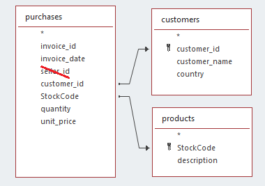

<h1 align="center">
MACHINE LEARNING PROJECT HIGH VALUE CUSTOMERS IDENTIFICATION 
</h1>

<h6>- <a href="README.md">VERSÃO EM PORTUGUÊS</a></h6>

# 1. INTRODUCTION

What is this project about? The challenge is to create a system capable of analyzing the behavior of customers from an e-commerce company and to categorize them into groups with similar characteristics, aiming to support the implementation of a marketing strategy.

As will be presented, using this project, it was possible to build a system capable of performing customer clustering, along with a front-end interface that allows business managers and marketing team to utilize it.

This project is based on a fictional case and utilizes a dataset from [Kaggle](https://www.kaggle.com/vik2012kvs/high-value-customers-identification).

However, it should be emphasized that the MAIN FOCUS is not just the creation of a machine learning solution for a data science competition, but rather the analysis of the business as a whole, aiming to understand the aspects that impact performance, with a view to improving the company's performance.

# 2. THE CONTEXT AND BUSINESS PROBLEM

In the fictional context of this project, there is a Multi-Brand Outlet company, which is a company that sells second-line products from various brands at a lower price through an e-commerce site.

In this company, the marketing team recently observed that some customers in their database frequently purchase more expensive products, contributing significantly to the company's revenue. Therefore, it was decided to launch a marketing campaign - the INSIDERS LOYALTY PROGRAM - aimed at the best customers in the database.

However, it would not be trivial for the marketing team to identify and select the customers eligible to participate in the program, given the high number of customers and the plan to perform periodic reviews of the participant lists. Because of this, the data science team was asked to conduct a study to select customers eligible for the program.

The task of the data science team consists of determining the customers eligible to participate in the INSIDERS LOYALTY PROGRAM marketing campaign. This involves segmenting the customers based on their purchases, to facilitate the execution of the envisioned marketing strategy.

# 3. SOLUTION PLANNING

The solution to the described business problem lies in the use of clustering algorithms, which allow identifying groups of similar people in a population and then allocating them to respective groups, or clusters.

## 3.1. Final Product

As outlined above, the goal is to train clustering algorithms to identify customers eligible to participate in the INSIDERS LOYALTY PROGRAM marketing campaign. Therefore, the delivered solution includes the following results:

- [Result No. 1](#11-result-i-main-business-insights) - Insights related to the customer base, especially regarding the customers most suitable for participation in the INSIDERS PROGRAM.

- [Result No. 2](#12-result-ii-machine-learning-system-for-customer-segmentation) - Python-based machine learning system for customer segmentation.

- [Result No. 3](#13-results-iii-power-bi-dashboard) - Power BI dashboard for use by the marketing team, allowing for dynamic visualization of the clusters, their key performance indicators (KPIs), and the list of customers in each cluster.

## 3.2. Solution Strategy

The work was conducted following the CRISP-DM method (or "Cross Industry Standard Process for Data Mining"), a cyclical approach that enhances the quality and speeds up the delivery of results in Data Science projects. The method can be summarized in the following set of steps:

1. Business Understanding
2. Data Collection, Processing, and Modeling
3. Machine Learning Algorithms
4. Results Evaluation
5. Deployment.

# 4. AVAILABLE DATA

The data is available in the ECOMMERCE.CSV file, comprising 541,909 purchase records, containing the following eight columns:

<table align="center">
  <tr>
    <th align="center">ATTRIBUTE</th>
    <th>DESCRIPTION AND OBSERVATIONS</th>
  </tr>
  <tr>
    <td align="center">InvoiceNo</td>
    <td>Unique identifier of the consumer sales invoice.</td>
  </tr>
  <tr>
    <td align="center">InvoiceDate</td>
    <td>Date of invoice issuance, or date of the sale of the merchandise.</td>
  </tr>
  <tr>
    <td align="center">CustomerID</td>
    <td>Unique identifier of the customer.</td>
  </tr>
  <tr>
    <td align="center">Country</td>
    <td>Country of purchase origin.</td>
  </tr>
  <tr>
    <td align="center">StockCode</td>
    <td>Unique identifier of the merchandise sold.</td>
  </tr>
  <tr>
    <td align="center">Description</td>
    <td>Free text description of the merchandise sold.</td>
  </tr>
  <tr>
    <td align="center">Quantity</td>
    <td>Number of units sold of the product.</td>
  </tr>
  <tr>
    <td align="center">UnitPrice</td>
    <td>Unit price of the product sold.</td>
  </tr>
</table>

The data presents a typical **INVOICE** structure, with information related to the following elements:

1. **SELLER** of goods or services, along with its registration details, such as name, address, and registration number with official bodies. In our practical case, as it concerns a single company, this information is not included in the CSV database.

2. **CUSTOMER** who purchases the goods or services, along with their registration details, such as name, identification number, and delivery address of the products. In our case, only the identification code (customer_id) and the country related to the invoice are included.

3. **DESCRIPTION OF THE GOODS** being negotiated. In our database, the code and description of each merchandise are listed.

4. **PURCHASES** included in the invoice, as a single invoice can involve the sale-purchase of various goods. Our database includes information about the goods being negotiated, the sale prices, the quantities sold, and the date of the transaction.

From this information, we can visualize the ECOMMERCE.CSV database according to the following simplified model:

<table align="center">
<tr><td>

</td></tr>
</table>

# 5. DATA PREPARATION

A detailed examination of the data required: loading the data file, content verification, handling of missing data - NaNs, descriptive statistics, close observation of the data, deletion of rows and columns, and *feature engineering*.

The code can be consulted in sections 0 to 3 of the [Jupyter Notebook](https://github.com/manoelmendonca/customers_clustering/blob/main/notebooks/insider_customers.ipynb). Some of the more important aspects are discussed below.

## 5.1. Handling Missing Data (NaN)

## 5.2. Descriptive Statistics

## 5.3. Data Filtering

## 5.4. Feature engineering: recency, frequency, and monetary value

## 5.5. Feature engineering: the countries

## 5.6. Feature engineering: revenue by day of the week and month

## 5.7. Feature engineering: fictitious names

# 6. EXPLORATORY DATA ANALYSIS - EDA

# 7. CLUSTERING WITH DECISION TREE-BASED EMBEDDING

# 8. FEATURE SELECTION

# 9. OPTIMIZATION OF MACHINE LEARNING MODELS

# 10. ANALYSIS OF CLUSTERS ACCORDING TO BUSINESS CRITERIA

# 11. RESULT-I: MAIN BUSINESS INSIGHTS

# 12. RESULT-II: MACHINE LEARNING SYSTEM FOR CUSTOMER SEGMENTATION

# 13. RESULTS-III: POWER BI DASHBOARD

# 14. CONCLUSION

# 15. NEXT STEPS

# 16. TOOLS USED

# 17. REFERENCE

