<h1 align="center">
PROJETO DE <i>MACHINE LEARNING</i> IDENTIFICAÇÃO DE CLIENTES DE ALTO VALOR 
</h1>

<h6>- <a href="README-en.md">ENGLISH VERSION</a></h6>

# 1. INTRODUÇÃO

O que é este trabalho? O desafio é criar um sistema capaz de analisar o comportamento dos clientes de uma empresa de e-commerce e fazer sua divisão em grupos de clientes com características semelhantes, com vistas a subsidiar a realização de uma estratégia de marketing.

Conforme será apresentado a seguir, com o uso do presente projeto foi possível construir um sistema capaz de realizar a referida clusterização de clientes, e com uma interface de *front-end* capaz de permitir a utilização por parte dos gerentes de negócio e equipe de marketing.

Este projeto se baseia em um caso fictício, e faz uso de uma base de dados do [Kaggle](https://www.kaggle.com/vik2012kvs/high-value-customers-identification).

Ressalte-se, no entanto, que o FOCO PRINCIPAL não é apenas a criação de uma solução de <i>machine learning</i> para uma competição de ciência de dados, mas a análise do negócio como um todo, buscando compreender os aspectos que impactam no desempenho, com vistas à melhoria do desempenho da empresa.

# 2. O CONTEXTO E O PROBLEMA DE NEGÓCIO

No contexto fictício do presente trabalho, tem-se uma empresa do tipo Outlet Multimarcas, ou seja, uma companhia que comercializa produtos de segunda linha de várias marcas a um preço menor, por meio de site de e-commerce.

Nessa empresa, o time de marketing recentemente observou que alguns clientes da sua base compram produtos mais caros e com alta frequência, contribuindo com uma parcela significativa do faturamento da empresa. Assim, decidiu-se pelo lançamento de uma campanha de marketing - PROGRAMA DE FIDELIDADE INSIDERS - voltado para os melhores clientes da base.

No entanto, não seria trivial para a equipe de marketing a tarefa de identificação e seleção dos clientes aptos a participar do programa, dado o elevado número de clientes e a previsão de realização de revisões periódicas das listas de participantes. Em razão disso, foi requisitado à equipe de ciência de dados a realização de estudo para seleção dos clientes elegíveis ao programa.

A tarefa da equipe de ciência de dados consiste em determinar os clientes elegíveis para participar da campanha de marketing PROGRAMA DE FIDELIDADE INSIDERS. Trata-se aqui da segmentação do rol de clientes com base em suas compras, de modo a permitir a realização da estratégia de marketing idealizada.

# 3. PLANEJAMENTO DA SOLUÇÃO

A solução para o problema de negócio descrito está na utilização de algoritmos de clusterização, os quais permitem identificar grupos de pessoas semelhantes em uma população e então alocá-las aos respectivos grupos, ou CLUSTERS.

## 3.1. Produto Final

Conforme apresentado acima, o objetivo é treinar algoritmos de clusterização para identificar os clientes aptos a participarem da campanha de marketing PROGRAMA DE FIDELIDADE INSIDERS. Assim, a solução apresentada compreende a entrega dos seguintes resultados:

1. Resultado nº 1 - Insights relacionados ao rol de clientes, em especial quanto aos clientes mais aptos para participação no PROGRAMA INSIDERS.

2. Resultado nº 2 - Sistema de <i>machine learning</i> em linguagem Python para segmentação de clientes.

3. Resultado nº 3 - Dashboard em Power BI para utilização pela equipe de marketing, permitindo a visualização dinâmica dos clusters, seus principais indicadores de desempenho (KPIs), e o rol de clientes integrantes de cada cluster.

## 3.2. Estratégia de Solução

O trabalho foi realizado seguindo o método CRISP-DM (ou "<i>Cross Industry Standard Process for Data Mining</i>"), uma abordagem cíclica capaz de aprimorar a qualidade e agilizar a entrega de resultados em projetos de Ciência de Dados. O método pode ser resumido no seguinte conjunto de etapas:

1. Entendimento do negócio
2. Coleta, tratamento e modelagem dos dados
3. Algoritmos de <i>Machine Learning</i>
4. Avaliação dos resultados
5. Entrada em produção.

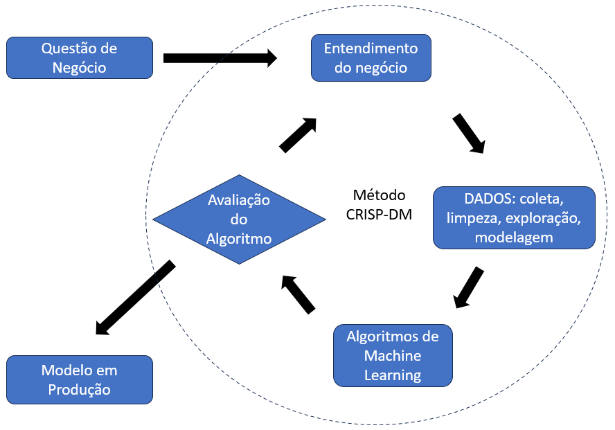

# 4. OS DADOS DISPONÍVEIS

Os dados estão disponíveis no arquivo ECOMMERCE.CSV, num conjunto de 541.909 registros de compras, contendo as seguintes oito colunas:

<table align="center">
  <tr>
    <th align="center">ATRIBUTO</th>
    <th>DESCRIÇÃO E OBSERVAÇÕES</th>
  </tr>
  <tr>
    <td align="center">InvoiceNo</td>
    <td>Identificador único da nota fiscal de venda ao consumidor.</td>
  </tr>
  <tr>
    <td align="center">InvoiceDate</td>
    <td>Data de emissão da nota fiscal, ou de venda da mercadoria.</td>
  </tr>
  <tr>
    <td align="center">CustomerID</td>
    <td>Identificador único do cliente.</td>
  </tr>
  <tr>
    <td align="center">Country</td>
    <td>País de origem da compra.</td>
  </tr>
  <tr>
    <td align="center">StockCode</td>
    <td>Identificador único da mercadoria vendida.</td>
  </tr>
  <tr>
    <td align="center">Description</td>
    <td>Texto livre de descrição da mercadoria vendida.</td>
  </tr>
  <tr>
    <td align="center">Quantity</td>
    <td>Quantidade de unidades vendidas do produto.</td>
  </tr>
  <tr>
    <td align="center">UnitPrice</td>
    <td>Preço unitário do produto vendido.</td>
  </tr>
</table>

(Fonte: [Kaggle](https://www.kaggle.com/vik2012kvs/high-value-customers-identification))

Os dados apresentam uma estrutura típica de **NOTA FISCAL**, com informações relativas aos seguintes elementos:

1. **EMPRESA VENDEDORA** de bens ou serviços, juntamente com seus dados cadastrais, como nome, endereço e número de registro junto aos órgãos oficiais. No nosso caso prático, por tratar-se de uma única empresa, essa informação não consta da base CSV.

2. **CLIENTE** comprador das mercadorias ou serviços, juntamente com seus dados cadastrais, como nome, número de identificação e endereço de entrega dos produtos. No nosso caso, tem-se apenas o código de identificação (customer_id) e o país a que se refere a nota fiscal.

3. **DESCRIÇÃO DAS MERCADORIAS** objeto da negociação. Em nossa base constam o código e a descrição de cada mercadoria.

4. **COMPRAS** integrantes da nota fiscal, visto que numa única nota fiscal é possível a compra-venda de diversas mercadorias. Em nossa base de dado constam informações das mercadorias objeto da negociação, os preços de venda, as quantidades vendidas e a data do negócio.

A partir dessas informações, podemos visualizar a base de dados ECOMMERCE.CSV obedecendo ao seguinte modelo simplificado:

<table align="center">
<tr><td>
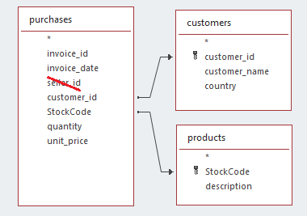
</td></tr>
</table>

# 5. PREPARAÇÃO DOS DADOS

A verificação detalhada dos dados demandou: carga do arquivo de dados, verificação de conteúdo, tratamento dos dados faltantes - NaN, estatística descritiva e observação detalhada dos dados, eliminação de linhas e colunas, e *feature engineering*.

O código pode ser consultado nas seções 0 a 3 do arquivo [Jupyter Notebook](https://github.com/manoelmendonca/clustering2024_priv/blob/main/notebooks/insider_customers_v1.ipynb). Alguns aspectos mais importantes são comentados a seguir.

## 5.1. Tratamento dos dados faltantes (NaN)

A inspeção dos dados (seção 1.1 do código) mostrou a existência de 135.080 registros nos quais **customer_id** = NaN. É um percentual elevado, correspondente a 24,9% da base. O tratamento para fins de clusterização teve duas abordagens.

- Na primeira rodada do CRISP-DM, buscou-se aproveitar esses dados, sintetizando-se valores fictícios para os dados faltantes. A clusterização ótima se deu com aproximadamente 32 clusters. Ao final, consideramos inapropriado o resultado, pois os clientes fictícios atuariam como ruído, dificultando a clusterização dos clientes reais.

- Na segunda abordagem, os 135.080 registros foram descartados, o que resultou numa clusterização mais assertiva, com 22 clusters. Esta foi a solução final adotada para este projeto.

Como última observação, caso esses 135.080 registros sejam importantes para uso em futuros algoritmos de *machine learning*, é possível seu aproveitamento por meio de procedimento inteligente de medição de similaridade entre compras com ID desconhecidos (NaN) e compras de clientes conhecidos. Essa abordagem está além do escopo do presente trabalho.

## 5.2. Estatística descritiva

A seção 1.5 do código apresenta notas detalhadas descrevendo as particularidades da base de dados, bem assim a conclusão quanto a manutenção ou deleção dos dados em cada caso. O objetivo de tais notas foi o de garantir a máxima qualidade dos dados a serem apresentados para os algoritmos de *machine learning*. Aos interessados, sugerimos que leiam diretamente a seção 1.5 no [notebook](https://github.com/manoelmendonca/clustering2024_priv/blob/main/notebooks/insider_customers_v1.ipynb).

As variáveis numéricas têm as características apresentadas na tabela abaixo (seção 1.5.1 do código).

<table align="center">
    <tr align="right;">
      <th align="center">attributes</th>
      <th align="center">min</th>
      <th align="center">max</th>
      <th align="center">range</th>
      <th align="center">mean</th>
      <th align="center">median</th>
      <th align="center">std</th>
    </tr>
    <tr>
      <td align="center">quantity</td>
      <td align="right">-80.995,00</td>
      <td align="right">80.995,00</td>
      <td align="right">161.990,00</td>
      <td align="right">12,06</td>
      <td align="right">5,00</td>
      <td align="right">248,77</td>
    </tr>
    <tr>
      <td align="center">unit_price</td>
      <td align="right">0,00</td>
      <td align="right">38.970,00</td>
      <td align="right">38.970,00</td>
      <td align="right">3,46</td>
      <td align="right">1,95</td>
      <td align="right">69,34</td>
    </tr>
    <tr>
      <td align="center">customer_id</td>
      <td align="right">12.346,00</td>
      <td align="right">18.287,00</td>
      <td align="right">5.941,00</td>
      <td align="right">15.288,63</td>
      <td align="right">15.152,00</td>
      <td align="right">1.713,28</td>
    </tr>
    <tr>
      <td align="center">latitude</td>
      <td align="right">-30,56</td>
      <td align="right">64,96</td>
      <td align="right">95,52</td>
      <td align="right">54,40</td>
      <td align="right">55,38</td>
      <td align="right">5,54</td>
    </tr>
    <tr>
      <td align="center">longitude</td>
      <td align="right">-106,35</td>
      <td align="right">138,25</td>
      <td align="right">244,60</td>
      <td align="right">-2,14</td>
      <td align="right">-3,44</td>
      <td align="right">10,40</td>
    </tr>
</table>

A tabela indica existirem registros com valores negativos para a **quantidade** de produtos vendidos. Infere-se que se tratem de produtos devolvidos. Para tratar dessa característica, os registros foram divididos em duas tabelas: tabelas de produtos comprados, **df2_purchase**, e de produtos retornados, **df2_returns** (seção 2.4 do código).

Em relação à coluna **unit_price**, a tabela indica diferença muito acentuada entre o valor máximo de $38.970 e a mediana de apenas $1,95. De fato, o gráfico de barras mostra que 97% dos registros contêm valores inferiores a $10, havendo apenas um valor superior a $30.000.

<table align="center">
<tr><td>
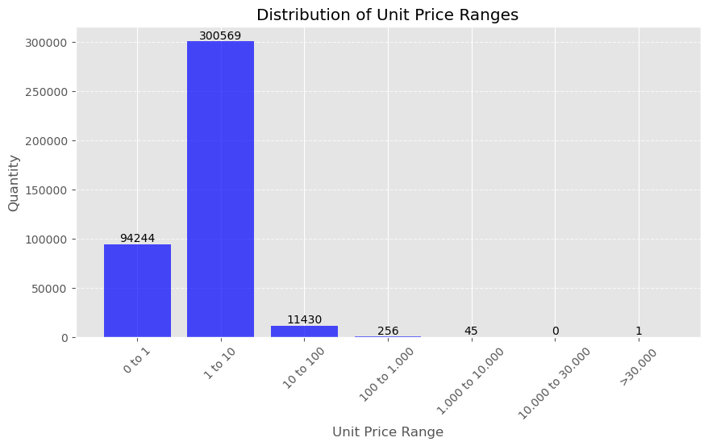
</td></tr>
</table>

## 5.3. Filtragem de dados

A filtragem dos dados consta da seção 2 do código e tomou por base as notas detalhadas da seção 1.5. Os seguintes procedimentos foram realizados:

- Forçada a caixa-alta para as colunas **invoice_no** e **stock_code**, visto ter sido percebida a ocorrência de **stock_code** = '82001S' e **stock_code** = '82001s' para a mesma mercadoria.
- Forçada a coluna **country** a conter nomes iniciando em maiúscula, demais caracteres minúsculos.
- Deletadas as linhas em que **unit_price** <= 0
- Deletadas as linhas em que **country** = 'Unspecified'
- Deletadas as linhas em que **stock_code** = 'AMAZONFEE', 'B', 'BANK CHARGES', 'M', 'S'
- Forçados os valores negativos de **quantity** para positivos (função abs) quando **stock_code**='CRUK', por se considerar que uma doação ao *Cancer Research UK* deva ser tratada contabilmente tal como uma compra de mercadoria.
- Deletadas as linhas referentes a **customer_id** = 12346, 16446, 15098, 15749, por terem maior quantidade de produtos devolvidos do que comprados.
- Deletadas as linhas referentes aos **customer_id** que tenham devolvido mais de 90% de todas as mercadorias compradas.
- Deletadas as linhas para as quais **customer_id** = NaN.

Ao final, dos 541.909 registros originais, restaram 405.522 (deletados 25,14%), sendo:
- 24,9% (135.080 registros) deletados, referentes a **customer_id** = NaN e
- 0,24% (1307 registros) deletados, referentes às demais regras.

A coluna de descrição das mercadorias - **description** - foi excluída da base (seção 2.3 do código). Chegamos a realizar alguns testes de uso dessa informação, porém sem obter ganhos para o objetivo de clusterização de clientes. Por isso, por critério de objetividade, a decisão final foi a de descartar a informação.

## 5.4. *Feature engineering*: recência, frequência e valor monetário

Na seção 3 do código - *Feature Engineering* - iniciou-se a montagem de uma base de dados de consumidores (**df_ref**), ou seja, com um registro para cada valor de **customer_id**. Nessa base de dados fez-se a construção dos indicadores de desempenho por consumidor (seção 3.1 do código), de modo a ressaltar:

- Recência: o tempo em dias desde o último comparecimento do cliente.
- Frequência: quantas vezes o cliente já comprou ao longo de seu histórico.
- Valor monetário: quanto o cliente costuma gastar.

Os indicadores construídos foram os seguintes:

<table align="center">
  <tr>
    <th align="center">Indicador</th>
    <th>Descrição</th>
  </tr>
  <tr>
    <td align="center">Receita Bruta</td>
    <td>= soma ( unit_price * quantity )</td>
  </tr>
  <tr>
    <td align="center">Recência</td>
    <td>Quantos dias se passaram desde a última compra de cada cliente</td>
  </tr>
  <tr>
    <td align="center">N# Invoices</td>
    <td>Quantidade de notas fiscais de cada cliente</td>
  </tr>
  <tr>
    <td align="center">N# Itens</td>
    <td>Quantidade de itens comprados por cada cliente</td>
  </tr>
  <tr>
    <td align="center">N# Itens Únicos</td>
    <td>Quantidade de tipos diferentes de produtos comprados por cada cliente</td>
  </tr>
  <tr>
    <td align="center">Ticket médio</td>
    <td>Valor médio dos itens comprados por cliente</td>
  </tr>
  <tr>
    <td align="center">Recência média entre compras</td>
    <td>Número médio de dias entre duas compras</td>
  </tr>
  <tr>
    <td align="center">N# de Devoluções</td>
    <td>Quantidade de produtos retornados por cada cliente</td>
  </tr>
  <tr>
    <td align="center">Tamanho da cesta</td>
    <td>Quantidade média de produtos em uma nota fiscal, por cliente</td>
  </tr>
  <tr>
    <td align="center">Tamanho da cesta produtos únicos</td>
    <td>Quantidade média de produtos únicos em uma nota fiscal, por cliente</td>
  </tr>
  <tr>
    <td align="center">Taxa de devolução</td>
    <td>(quantidade de retornos) dividido por (quantidade de itens comprados)</td>
  </tr>
</table>

## 5.5. *Feature engineering*: os países

A partir da informação dos países dos clientes, experimentou-se a criação de indicadores do tipo one-hot-encoding. No entanto, esse procedimento não resultou em melhoria dos resultados da clusterização, de modo que foi descartada sua utilização no projeto.

## 5.6. *Feature engineering*: faturamento por dia da semana e do mês

Ideia: haverá alguma semelhança entre clientes que comprem sempre às segundas-feiras, ou aos sábados? Do mesmo modo, haverá semelhanças entre clientes que comprem sempre no dia 10 de cada mês?

Para capturar esse tipo de comportamento, a receita bruta de cada cliente foi distribuída entre os sete dias da semana, de acordo com as respectivas datas de compra. Do mesmo modo, a receita bruta foi distribuída entre os 31 dias do mês. Os valores distribuídos foram transformados em percentuais, gerando as *features* de faturamento por dia da semana e por dia do mês.

O processamento inicia-se na seção 3.1.1 e é concluído na seção 3.3 do código.

Estas *features* trouxeram melhoria para o procedimento, aumentando a medição de *silhouette score* da clusterização.

## 5.7. *Feature engineering*: nomes fictícios

A síntese de nomes fictícios para a base de clientes (seção 3.4 do código) não visava a melhoria da clusterização. O intuito inicial foi o de humanizar as telas de *front-end* do projeto.

No entanto, o procedimento trouxe um BENEFÍCIO INESPERADO referente aos registros desprovidos de **customer_id**. Na primeira rodada do projeto buscamos aproveitar os 24,9% dos registros sem cliente conhecido. No entanto, para esses não demos nomes, mas apenas os denominamos como "DESCONHECIDOS". Como resultado, no *dashboard* final foi possível constatar que haviam clientes "DESCONHECIDOS" em todos os clusters. Isso foi considerado como uma característica não aceitável no projeto. Enfim, foi a criação dos nomes fictícios e a utilização do *dashboard* que acendeu o alerta para a necessidade de refazer os procedimentos com a exclusão dos registros desprovidos de **customer_id**.

No algoritmo para geração dos nomes fictícios, fez-se a montagem de duas listas:

- lista de nomes de personagens interncionais do cinema & TV, e
- lista de sobrenomes brasileiros típicos, singulares e até inventados.

A montagem final dos nomes foi feita juntando, de modo aleatório, um nome seguido de dois sobrenomes. Como exemplo, alguns resultados obtidos incluem:

- Forrest Gump Virgulino Denteleite
- Black Panther do Monte Avelino
- Bruce Banner Terceiro Pinto
- Captain America Terto da Silva

# 6. ANÁLISE EXPLORATÓRIA DE DADOS - EDA

Na seção 4 do código foi realizada a análise univariada dos dados constantes da base, de modo a verificar, para cada *feature*:

- se a média e a mediana estariam próximas, a faixa de distribuição dos valores, e se as informações parecem naturais ou se há a possibilidade de *outliers*,
- O coeficiente de variação (CV) se tem valores compatíveis com a média
- Se os valores extremos são aceitáveis ou se seriam *outliers*
- remoção de valores indevidos ou errados (=*trash*)

Para realização dessas análises, fez-se uso da biblioteca *ydata_profiling* e da sua função *ProfileReport*. Os resultados permitiram a elaboração de uma série de notas de observação bastante detalhadas, constantes das seções 4.1.13 e 1.5 do código.

# 7. CLUSTERIZAÇÃO COM *EMBEDDING* BASEADO EM ÁRVORE DE DECISÃO

Neste projeto, o agrupamento de indivíduos (clustering) é feito por meio de um procedimento em três etapas, a saber:
- (i) classificação dos indivíduos por meio de árvores de decisão, ou *random forest*;
- (ii) redução de dimensionalidade da base de indivíduos classificados, usando algoritmos como UMAP, PCA ou t-SNE, e
- (iii) clusterização da base resultante, utilizando K-Means ou GMM.

O algoritmo está construído nas seções 5.3.0 e 6.2 do código.

O método de incorporação (ou *embedding*) consiste "em uma representação densa de alguns dados de dimensões superiores, como uma categoria ou uma palavra em um vocabulário" (Géron1, pg. 466). Como exemplo, a figura abaixo (seção 5.2.2 do código) mostra a redução da base de dados do projeto para duas dimensões por meio do algoritmo UMAP:

<table align="center">
<tr><td>
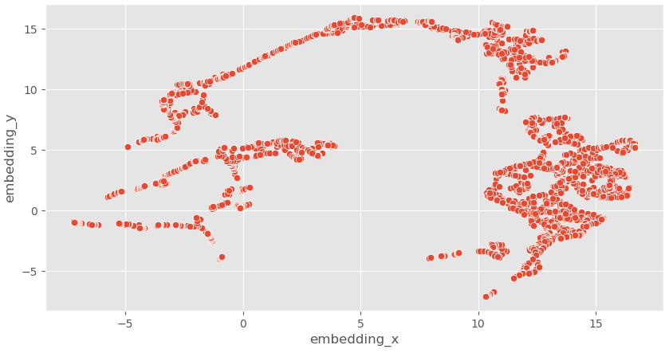
</td></tr>
</table>

A próxima figura apresenta a base de dados do projeto submetida ao procedimento de classificação por *random forest* seguido de redução de dimensionalidade por UMAP. Observa-se que, diferente da figura anterior, neste caso foi possível gerar uma grande quantidade de grupos bem separados entre si, o que certamente se reflete na maior eficiência do algoritmo de clusterização.

<table align="center">
<tr><td>
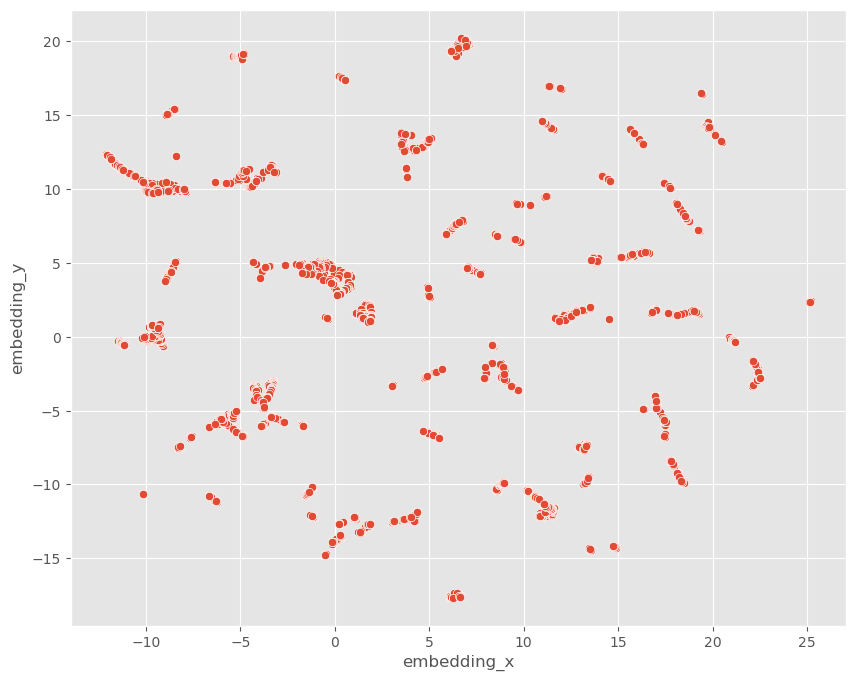
</td></tr>
</table>

Entre as vantagens dessa estratégia no presente projeto está a obtenção de agrupamentos de qualidade elevada, haja vista os altos níveis obtidos para o indicador *silhouette score*, superiores a 80%.

Por outro lado, o aspecto negativo está na impossibilidade de interpretação dos resultados, ou seja, não há uma explicação clara dos motivos que levam determinados indivíduos a terem sido colocados em um mesmo cluster.

# 8. SELEÇÃO DE *FEATURES*

Após a etapa de *feature engineering* resultar na criação de 50 colunas na base de dados, torna-se necessário averiguar quais seriam realmente capazes de melhorar o desempenho do modelo.

No presente projeto, partimos do modelo com todas as 50 *features* e aplicamos a técnica de eliminação recursiva de *features* (ou *Recursive Feature Elimination* - RFE). É denominado de procedimento de "força bruta", visto demandar muito recurso de processamento.

O método (seção 5.3 do código) foi construído com os seguintes passos:

1. rodar o modelo com todas as 50 *features* possíveis, para estabelecer o desempenho de referência;
2. iniciar o procedimento RFE em dois laços:
3. LOOP-externo: controla a redução, uma a uma, do número de *features* no conjunto de teste
4. LOOP-interno: dado o conjunto de N *features* de teste, rodar o modelo N vezes, excluindo uma das *features* a cada vez
5. Calcular o *silhouette score* e verificar se houve melhora no desempenho do modelo sem aquela feature. Em caso positivo, tem-se uma *feature* "campeã", candidata a exclusão.
6. Fim do LOOP-interno
7. Salvar a *feature* campeã e atualizar a lista de *features* sob teste, excluindo a "campeã"
8. Fim do LOOP-externo: quando não houver mais nenhuma campeã, ou se chegar em quantidade mínima de *features*

Com a utilização desse procedimento, e após quase 20 horas de processamento, chegamos a um conjunto ótimo de 16 *features*.

# 9. OTIMIZAÇÃO DOS MODELOS DE *MACHINE LEARNING*

Conforme descrito acima (seção 7), a clusterização é realizada em 3 etapas. Mas quais são os algoritmos mais eficientes em cada etapa? E quais são os melhores valores para seus hiperparâmetros?

Para responder a esses questionamentos, rodamos a seguinte sequência de códigos de otimização (seção 6 do código):

1. teste do tipo de algoritmo de árvore: RandomForest, ExtraTrees, LightGbm, CatBoost, XGBoost.
2. variação do hiperparâmetro *n_estimators* (número de estimadores) da árvore eleita no passo anterior.
3. teste do tipo de função de redução de dimensionalidade: UMAP, TSNE, PCA.
4. teste do hiperparâmetro de dimensão da função de redução eleita no passo anterior.
5. teste de diferentes algoritmos de clusterização, no caso: K-Means ou GMM

Os testes indicaram como melhor seleção o seguinte conjunto de algoritmos e hiperparâmetros:
- *Random Forest* com *n_estimator* = 300,
- UMAP com dimensão 43,
- clusterização com GMM - *Gaussian Mixture Model*, e
- número de clusters = 22.

Abaixo o gráfico do indicador *silhouette score* em função do número K de clusters, indicando silhueta máxima de 85,65% para K = 22.

<table align="center">
<tr><td>
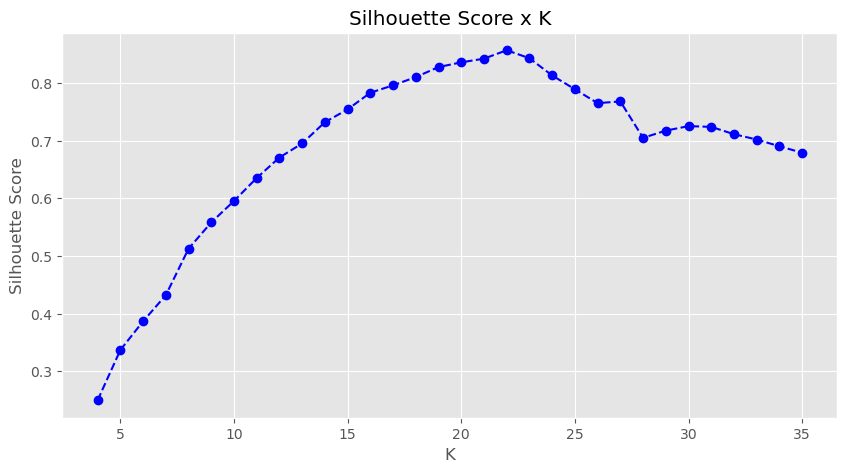
</td></tr>
</table>

O modelo com 22 clusters pode ser visualizado em duas dimensões conforme imagem a seguir (seção 6.3.3 do código):

<table align="center">
<tr><td>
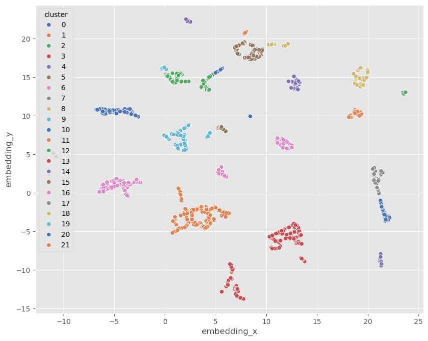
</td></tr>
</table>

# 10. ANÁLISE DOS CLUSTERS SEGUNDO CRITÉRIOS DE NEGÓCIO

Uma vez obtida a divisão de clusters considerada ótima sob os critérios de *machine learning*, partiu-se para sua avaliação em termos de atendimento aos requisitos de negócio para implantação de estratégias de marketing.

Apuradas as estatísticas para cada cluster (seção 7.2 do código), verificou-se que a manutenção de um elevado número de grupos traria dificuldades para a análise por parte dos gerentes de negócio e das equipes de marketing. O interesse principal já manifestado pela empresa recaía nos clientes com elevada geração de receita.

A solução encontrada foi a de manter a clusterização ótima, obtida com 22 clusters, para num segundo momento fazer a fusão de clusters de menor interesse.

Assim, foram mantidos os 4 clusters de maior geração de receita média por cliente, e junção dos demais 18 clusters em apenas 4, da seguinte forma (seção 7.3 do código):

- dentre os 18, fusão-1 dos clusters com alta receita e alta recência,
- fusão-2 dos clusters com alta receita e baixa recência,
- fusão-3 dos com baixa receita e alta recência, e
- fusão-4 dos com baixa receita e baixa recência.

O resultado gráfico da fusão de clusters pode ser observado na imagem a seguir (seção 7.3 do código), na qual os quatro clusters mais importantes foram marcados com cruzes, o de menor receita e mais populoso ("*Lost Customers*") foi marcado com quadrados e os demais com círculos:

<table align="center">
<tr><td>
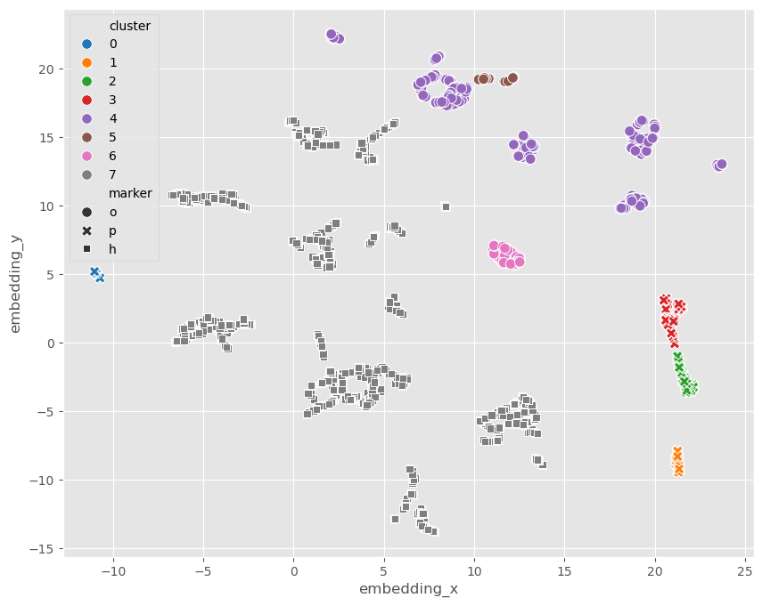
</td></tr>
</table>

Por fim, apresenta-se abaixo a listagem de clusters, incluindo uma denominação por grupo e os valores médios das principais características dos respectivos integrantes.

<table align="center">
  <tr>
    <th align="center">#</th>
    <th align="center">Cluster Name</th>
    <th align="center">Qt. Clientes</th>
    <th align="center">Receita Bruta</th>
    <th align="center">Recência (dias)</th>
    <th align="center">Frequência Média</th>
    <th align="center">Taxa de Devolução (%)</th>
    <th align="center">Qt. Notas Fiscais</th>
    <th align="center">Qt. Itens</th>
  </tr>
  <tr>
    <td align="center">0</td>
    <td align="left">ELITE SPENDERS</td>
    <td align="center">36 (0,8%)</td>
    <td align="right">66.976,1</td>
    <td align="center">10</td>
    <td align="right">0,1012</td>
    <td align="right">4,57%</td>
    <td align="right">50,4</td>
    <td align="right">38.947</td>
  </tr>
  <tr>
    <td align="center">1</td>
    <td align="left">LOYAL HIGH SPENDERS</td>
    <td align="center">97 (2,2%)</td>
    <td align="right">11.121,4</td>
    <td align="center">20</td>
    <td align="right">0,0503</td>
    <td align="right">1,85%</td>
    <td align="right">18,8</td>
    <td align="right">6.897</td>
  </tr>
  <tr>
    <td align="center">2</td>
    <td align="left">ENGAGED SHOPPERS</td>
    <td align="center">164 (3,8%)</td>
    <td align="right">5.792,2</td>
    <td align="center">29</td>
    <td align="right">0,0347</td>
    <td align="right">1,40%</td>
    <td align="right">12,4</td>
    <td align="right">3.613</td>
  </tr>
  <tr>
    <td align="center">3</td>
    <td align="left">OCCASIONAL BUYERS</td>
    <td align="center">179 (4,2%)</td>
    <td align="right">3.955,6</td>
    <td align="center">28</td>
    <td align="right">0,0311</td>
    <td align="right">1,50%</td>
    <td align="right">9,2</td>
    <td align="right">2.328</td>
  </tr>
  <tr>
    <td align="center">4</td>
    <td align="left">AVERAGE CUSTOMERS</td>
    <td align="center">887 (21%)</td>
    <td align="right">2.053,7</td>
    <td align="center">44</td>
    <td align="right">0,0237</td>
    <td align="right">1,52%</td>
    <td align="right">5,7</td>
    <td align="right">1.212</td>
  </tr>
  <tr>
    <td align="center">5</td>
    <td align="left">DORMANT CUSTOMERS</td>
    <td align="center">91 (2,1%)</td>
    <td align="right">1.426,4</td>
    <td align="center">68</td>
    <td align="right">0,0180</td>
    <td align="right">0,41%</td>
    <td align="right">3,2</td>
    <td align="right">952</td>
  </tr>
  <tr>
    <td align="center">6</td>
    <td align="left">FADING CUSTOMERS</td>
    <td align="center">172 (4,0%)</td>
    <td align="right">931,9</td>
    <td align="center">64</td>
    <td align="right">0,0186</td>
    <td align="right">1,41%</td>
    <td align="right">4,2</td>
    <td align="right">432</td>
  </tr>
  <tr>
    <td align="center">7</td>
    <td align="left">LOST CUSTOMERS</td>
    <td align="center">2686 (62%)</td>
    <td align="right">470,9</td>
    <td align="center">122</td>
    <td align="right">0,0195</td>
    <td align="right">1,19%</td>
    <td align="right">1,9</td>
    <td align="right">248</td>
  </tr>
</table>

Alguns dos dados acima podem ser comparados por meio dos gráficos a seguir, que mostram as características de número de clientes, receita bruta média, e relação entre receita bruta média e recência.

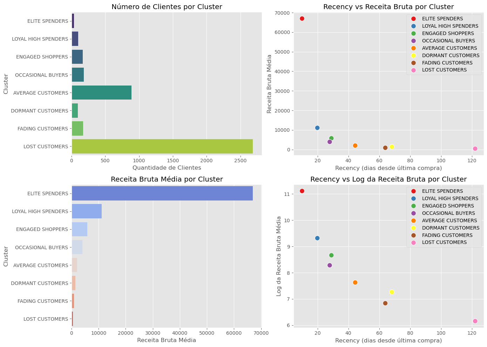

# 11. RESULTADO-I: PRINCIPAIS <i>INSIGHTS</i> DE NEGÓCIO

## Insight nº 1: Por se tratar de um *e-commerce*, as vendas ocorrem todos os dias e ao longo de 24 horas.
Hipótese <b>FALSA</B>: Os dados mostram que, ao longo de pouco mais de 1 ano, não houve nenhuma nota fiscal emitida numa sexta-feira (sessão 3.1.1 do código). Por ser situação pouco usual, é cabível apresentar o caso aos gerentes de negócio e à equipe de dados, para verificação se esse comportamento pode ser considerado normal.

## Insight nº 2: Os consumidores pertencentes ao CLUSTER-0 "*Elite Spenders*" têm um volume médio de itens comprados pelo menos 100% maior do que a média total
Hipótese <b>VERDADEIRA</B>: Os números indicam que os "*Elite Spenders*" compraram 38.947 itens em média, quase 34x mais do que a a média total, de 1.155.

## Insight nº 3: Os consumidores pertencentes ao CLUSTER-0 "*Elite Spenders*" apresentam taxa de devolução de produtos inferior à média total
Hipótese <b>FALSA</B>: a taxa de devolução do cluster-0 "*Elite Spenders*" é de 4,57%, mais do triplo do verificado nos demais clusters.

# 12. RESULTADO-II: SISTEMA DE *MACHINE LEARNING* PARA SEGMENTAÇÃO DE CLIENTES

O sistema de *machine learning* resultante é aquele dado pelo arquivo [Jupyter Notebook](https://github.com/manoelmendonca/clustering2024_priv/blob/main/notebooks/insider_customers_v1.ipynb) desenvolvido ao longo deste projeto e disponível no repositório do GitHub.

# 13. RESULTADOS-III: DASHBOARD EM POWER BI

Com o objetivo de permitir a consulta aos resultados do procedimento de clusterização de clientes, foi preparado um sistema de *dashboards* em PowerBI, de modo a facilitar a consulta e análise dos dados por parte dos gerentes de negócio e equipe de marketing.

A primeira tela apresenta os dados comparativos dos clusters, com seus KPIs e desempenhos relativos.

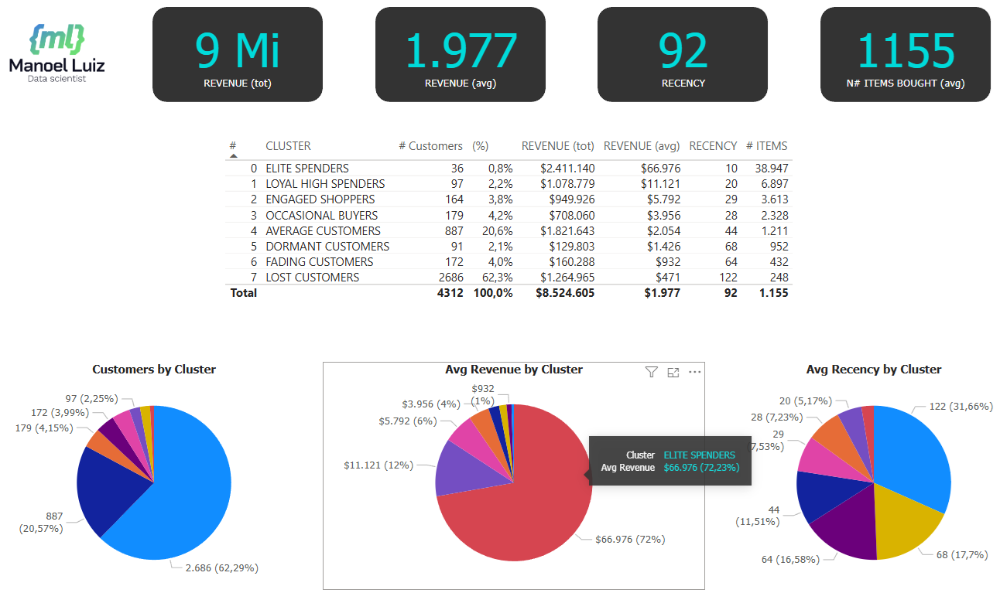

A segunda tela proporciona o acesso a informações específicas dos clientes integrantes de cada cluster.

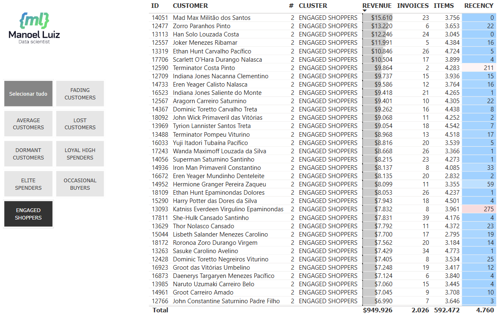

A terceira tela apresenta um mapa-mundi com a divisão geográfica dos clientes

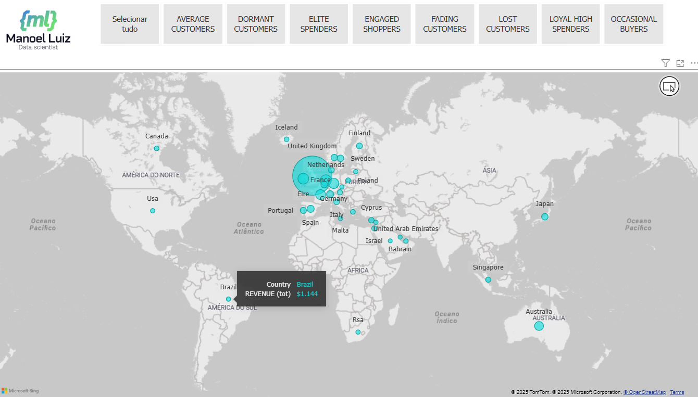

# 14. CONCLUSÃO

Por meio do presente projeto foi feita a análise dos clientes de um *e-commerce* e sua divisão em grupos em razão de suas características e comportamento de compras, com a finalidade de subsidiar o lançamento de uma campanha de marketing - PROGRAMA DE FIDELIDADE INSIDERS - voltado para os melhores clientes da base.

Como resultado do trabalho, obteve-se: (i) a elaboração de insights de negócio a partir dos dados, (ii) a construção de um sistema baseado em *machine learning* para clusterização dos clientes, e (iii) a construção de um *dashboard* em Power BI para utilização pelos gerentes de negócio e equipe de marketing.

Ressalte-se que as técnicas de clusterização aqui apresentadas são igualmente úteis para aplicação como instrumento de *feature engineering* para aprimoramento de algoritmos de regressão e classificação.

# 15. PRÓXIMOS PASSOS

Há alguns aprimoramentos e novos projetos possíveis, dentre os quais:

1. Análise do comportamento dos clientes ao longo do tempo, de modo a verificar a efetividade das campanhas de marketing.
2. Colocação do sistema de *machine learning* e respectivo *dashboard* em nuvem.
3. Análise e clusterização do rol de mercadorias.
4. Criação de sistema de *machine learning* para previsão e otimização do estoque.

# 16. FERRAMENTAS UTILIZADAS

No desenvolvimento do presente trabalho, as seguintes ferramentas foram utilizadas:
- Linguagem de Programação Python, versão 3.11.9
- Versionador de códigos GIT
- Jupyter Notebook & Visual Studio Code
- Dashboard com Power BI
- Algoritmos de machine learning da biblioteca scikit-learn
- ChatGPT 4o

Em tempo, o presente texto na versão em português foi preparado sem a ajuda de IA generativa. Por sua vez, seu versionamento para o inglês foi feito utilizando-se o ChatGPT, com nossa revisão.

# 17. REFERÊNCIA

1. Livro: *Hands-On Machine Learning with Scikit-Learn, Keras & TensorFlow*, Aurelién Géron, 3ª edição, 2023.
